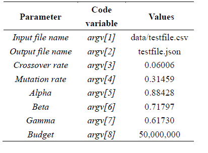
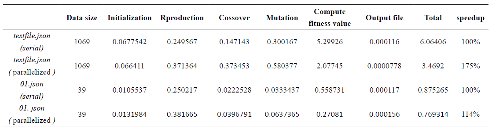

# Road-maintainance-project-OpenMP

## About the project 
This is the OpenMP optimized version of this [Road-maintainance-project](https://github.com/EasternGD/Road-maintainance-project).

## Dependencies
* Ubuntu
* g++
* OpenMP

## Setup
```sh
make all      -- Produce executable file and import all of the data to generate the result.
```

## Command Line argument

<!-- argument table -->
<br />
        <p align="left">
                       
        </p>
<br/>

## Performance
`testfile.csv` is all of the road data from the government offered.
`01.csv` is small size data from `testfile`, used to test program.

<!--Performance -->
<br />
        <p align="left">Unit: sec
                       
        </p>
<br/>

For this project, we can get a 175% accelerated runtime.

## Folder Structure
* Data is saved into the `data` folder.
* Header files is saved into the `inc` folder.
* Code is saved into the `src` folder.

## Contact

Abbey, Chen - encoref9241@gmail.com

Project Link: [Road-maintainance-project-OpenMP](https://github.com/EasternGD/Road-maintainance-project-OpenMP.git)
